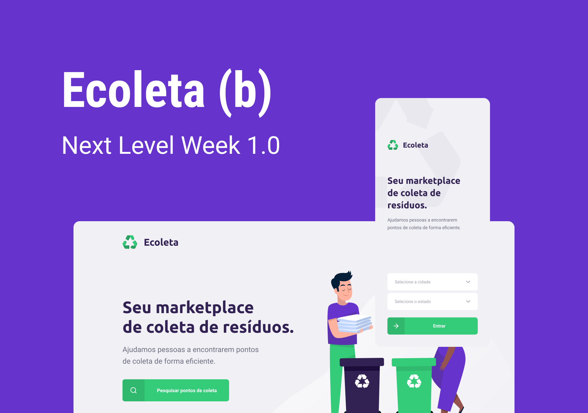

# 

<br/>
  
> Ecoleta App is a full-fledged application using the OmniStack (Node.js, React and ReactNative). It´s a marketplace for waste collection where the user can register collection points through the web app and on the mobile, the user can check the details of each point on the map.

## Backend

To run the backend, execute this command:

```
cd backend
yarn
yarn start
```

Technologies used

- Node.js
- Knex
- SQLite3
- Added validation with Celebrate API

## FrontEnd

To run the frontend, execute this command:
<br />

```
cd frontend
yarn install
yarn start
```

Technologies used

- React JS
- React Router
- Feather Icons
- Leaflet ( Maps API )
- IBGE API
- Axios

## Mobile

To run the mobile app, execute this command:

```
cd mobile
yarn
yarn start
```

Technologies used

- React Native
- React Native Maps
- React Native Router
- Expo
- Axios
- Expo Google Fonts
- Feather Icons
- Deep Linking with Whatsapp
- Expo Mail Composer